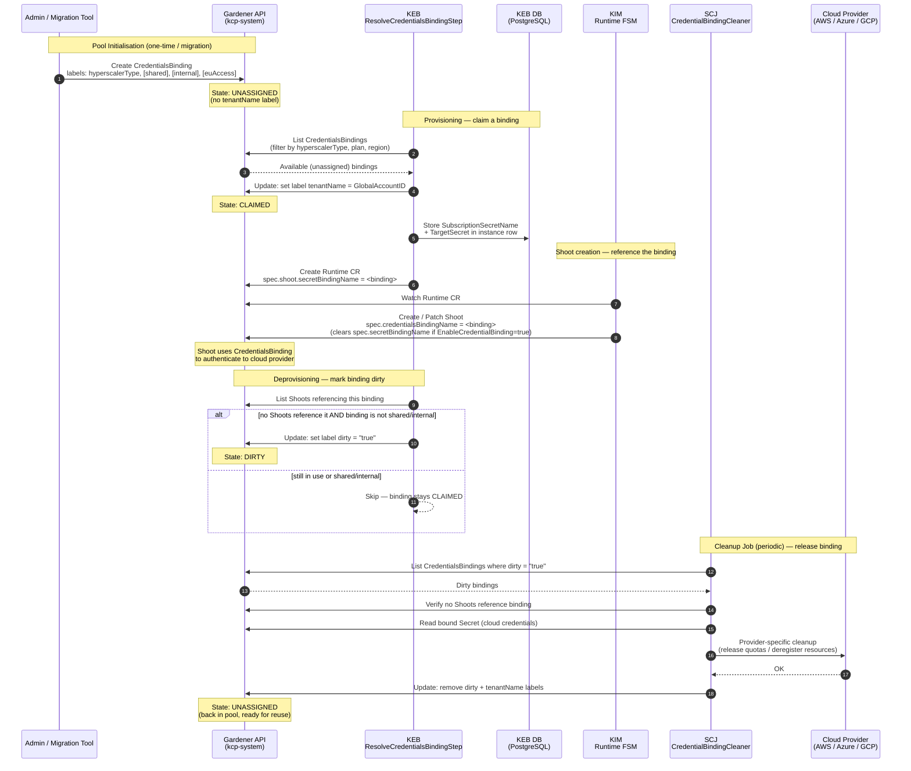
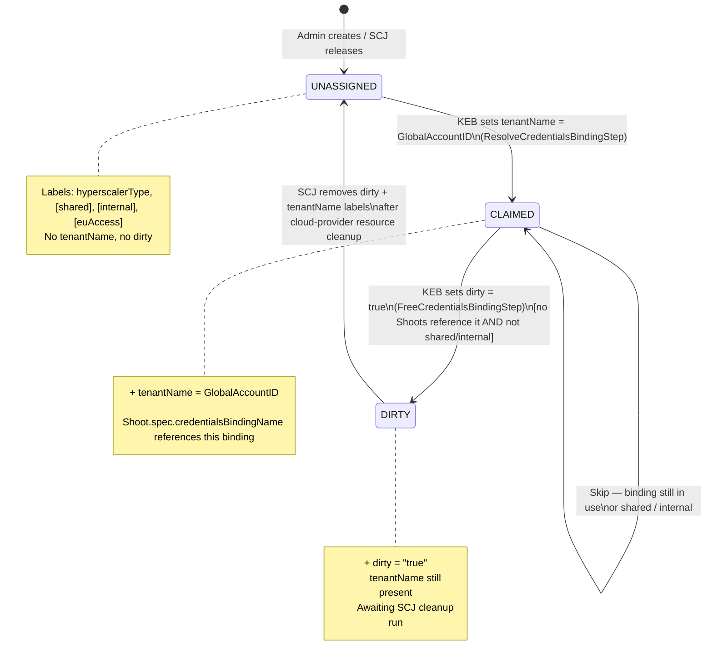

# CredentialBinding Management: KEB ↔ KIM ↔ SCJ

---

## CredentialBinding Label State Machine

---

## Component Responsibility Summary

| Action | Component | Mechanism |
|--------|-----------|-----------|
| Create CredentialsBinding in pool | Admin / Migration tool | `hack/credentialbindings/main.go` |
| Claim binding (set `tenantName`) | KEB — `ResolveCredentialsBindingStep` | `UpdateCredentialsBinding()` via Gardener client |
| Store assignment | KEB — DB write | `SubscriptionSecretName` in instance row |
| Reference binding in Shoot | KIM — Runtime FSM | `ExtendWithCredentialsBinding()` → `Shoot.spec.credentialsBindingName` |
| Mark dirty (`dirty=true`) | KEB — `FreeCredentialsBindingStep` | Label update on deprovisioning |
| Cloud-resource cleanup + label reset | SCJ — `CredentialBindingCleaner.Do()` | Provider cleaner → remove `dirty` + `tenantName` |

**SCJ** = Subscription Cleanup Job (`subscription-cleanup-job`)
**KIM** = Kyma Infrastructure Manager (`kyma-infrastructure-manager`)
**KEB** = Kyma Environment Broker (`kyma-environment-broker`)
